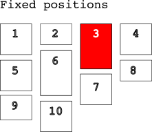

[](https://codeclimate.com/github/sablonier/flexcards) 

'Flexcards' theme for Bolt CMS
---

#### Using Bootstrap 4
Flexcards is made for the famous Bolt CMS (> 3.0), working with Bootstrap 4 'card' component for a simple, dynamic and flexible grid layout. For developing and extending flexcards you will need to work with .twig-Templating and Bootstrap 4 (see [Resources](#resources) below).

- [Theme features](#features)
- [Installation](#installation)
- [Configuration](#configuration)
- [Resources](#resources)

:no_bell: 
Before you start using this experimental work for production you should probably read about *what browser versions are supported with Bootstrap 4*. Have a look here: [Browsers supported](http://v4-alpha.getbootstrap.com/getting-started/browsers-devices/)

## <a name="features"></a>Features
Flexcards is using Bootstrap 4 Card component for a gallery-like (or 'pinterest-like' you might throw in) solution for blog entries or any other content, ordered in read direction for all devices, using paging if needed. 

It provides a responsive **4 columns grid** based on 12 columns grid of bootstrap. You can extend flexcards to provide **fixed positions** for a card (see section [Configuration](#configuration)). 


>Note: Flexcards javascript does not make use of ~~jQuery~~ or ~~masonry~~ scripts, and flexcards is shipped with **slim version of jQuery** and theter.js (because bootstrap 4 needs it). And no, the theme does not cover parallax, lazy loading and other 'lost content' design. 

## <a name="installation"></a>Installation

#### Requirements
* New or updated installation of [Bolt CMS >= v3.2.0](http://www.bolt.cm)

You can also give older Bolt versions ^3.0 a try but, please do not file any issues based on older versions. Current 'Flexcards' development is based on Bolt CMS v3.2.6.

#### Install via 'Extend' on Dashboard
You will need to install the famous Bolt CMS on your server, or update your current Bolt install to latest stable release. Flexcards is available in the [Bolt extensions store](https://market.bolt.cm/) and it is available directly in your bolt dashboard. As administrator of the site navigate to 'Extend' and search for 'flexcards'. Installation is self-explaining, in case you are running into problems [read here](https://docs.bolt.cm/3.2/extensions/introduction#installing-new-extensions).

#### Install manually
In case you will give an older Bolt CMS install a try or unknown restrictions on your server do not allow bolt dashboard installations) you can download flexcards from github and install it directly on your server. Just unzip the flexcards folder into your `themes` folder and set 'flexcards' as theme in your `config.yml`.

## <a name="configuration"></a>Configuration

#### Basic configuration in `flexcards/theme.yml`
```diff
# Content for frontpage
# ---------------------
# Defines the content lookup for the cards on frontpage.
# By default flexcards takes 10 latest records of contenttype 'entries'
contenttypes: entries
orderby: -datepublish
limit: 10
	
# Logo
# ----
# default is 'brand/flexcard.svg'
# set to 'false' to skip logo at all
logo: 'brand/flexcard.svg'
	
# Footer
# ------
# You can bring up your own html here, but
# in case you want to extend your footer with additional content like
# menus or widgets you better have a look to partials/_footer.twig
footerhtml: "<p>Your footer html goes here.</p>"
	
# Pager
# -----
# These are experimental responsive pagers (pagination) for Bolt CMS.
# You can activate this stuff separately, or disable it at all
# with setting it to 'false' and implementing your custom paging system.
	
# Listing pages
# -------------
# Define which contenttypes should show up with date and authors
# on listing pages
showmeta: [ Entries, Showcases ]
# Define count of cards on listing pages separately, affects paging
listing_records: 10 
```

#### Extending: Cards at fixed positions 


You can provide custom positions and 'sticking' for the cards without changing Bolt query strings. Card position follows **right-to-left, top-to-bottom**. For extending with fixed positions will need to add an additional field in your contenttype used for the cards. 

Here is an example of adding a `position` field to 'entries' content in `app/config/contenttypes.yml` (or via dashboard Configuration->ContentTypes). This example will show a new editable field position on top of entries, after updating your database (Configurarion->Check Database).

```diff
entries:
    name: Entries
    singular_name: Entry
    fields:
+       position:
+           label: Grid position
+           type: integer
+           group: content
        title:
            type: text
            class: large
            group: content
            ...
```
This will show up when you edit 'entries' now (after updating the database):


## Resources
All the standard scripts and css are included in the theme (no CDN links). For more information about using this resources for your own work:

 * [Bolt CMS templating](https://docs.bolt.cm/3.2/getting-started/introduction)
 * [bootstrap 4](https://v4-alpha.getbootstrap.com/) as framework
 * [twig 1 & 2](http://twig.sensiolabs.org/doc/2.x/) docs used for advanced templating with Bolt CMS
 * [jQuery 3](https://jquery.com/download/) watch out for no-jquery solutions or use the the slim version at least
 * [theter](http://tether.io/) in case you want to use bootstrap tooltips
